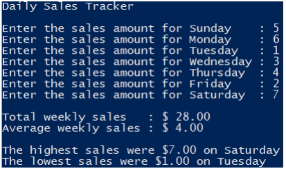

# Restaurant Sales

### Instructions:
 
- Design a Python program that uses sequences to track daily sales at a restaurant over a week’s time. The program should first prompt the user for the sales amount for each day of the week. The program should calculate and display the total weekly sales and the average weekly sales. The program should calculate and display the maximum and minimum daily sales amounts along with the day on which they occurred. 
  - You can create a tuple to hold the spelled-out days of the week (i.e. Sunday, Monday…) then use the tuple in a for loop to prompt for each day’s sales and collect the data input into a list. 
  - Your code must store the daily sales amounts in a list.
- Enter your name, the lab number, and the current date into a set of comments at the top of the code.	
- Push the program source code to the assignment repo. 

### Example Output

### Grading:
- General, compiles, comments, proper indentation, etc
- Use of Tuple
- Use of List
- Input Processing  
- Total Sales Calculation  
- Average Calculation  
- Minimum/Maximum Calculation
